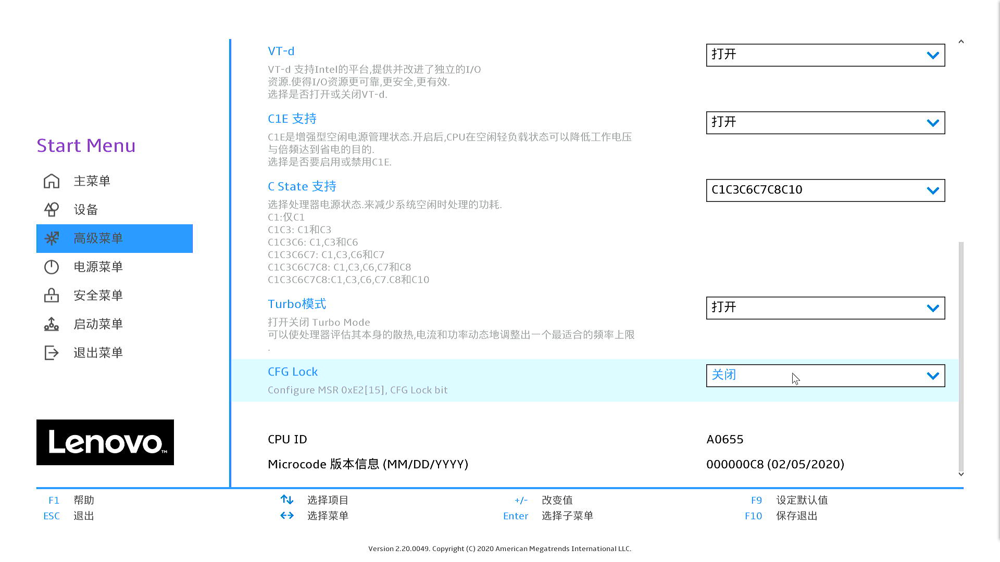
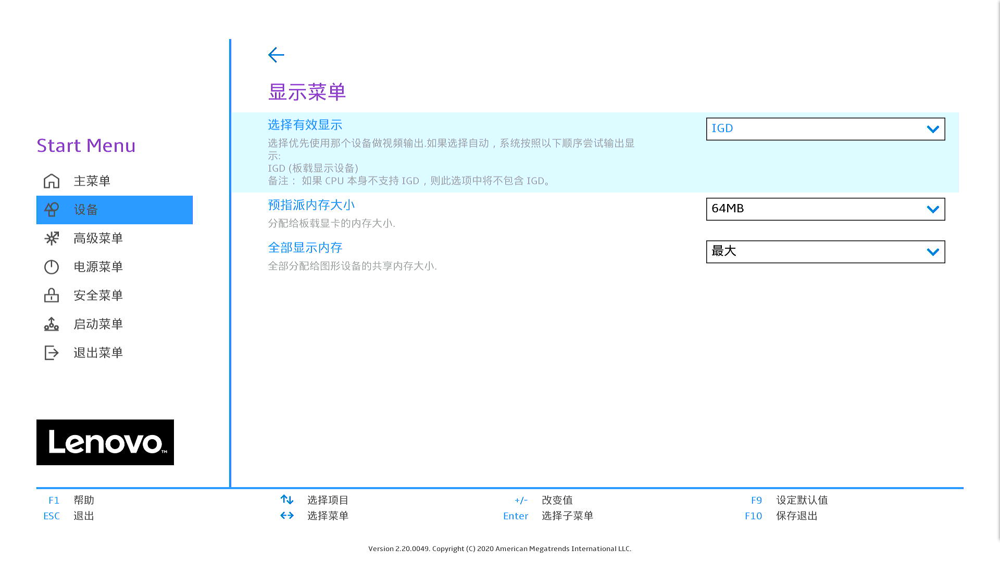

## Lenovo 510s EFI
- 核显搭配4K显示器
- 蓝牙有线网卡正常
- 集显驱动正常

---

## 配置信息

|   规格   |                           详细信息                           |
| :------: | :----------------------------------------------------------: |
| 电脑型号 |                  联想Lenovo 天逸 510S-07ICK                    |
| 操作系统 |                        MacOS Monterey                         |
|  处理器  |                    英特尔 酷睿 i5 - 9600k                       |
|   内存   |                       海盗船  8 GB x 2                         |
|  硬盘1   |               SAMSUNG 980 NVMe SSD 512GB                      |
|   显卡   |                  Intel UHD Graphics 630                      |
|  显示器  |                              无                               |
|   声卡   |                        Realtek ALC235                        |
|   网卡   |                Realtek RTL8168H/8111H                        |

---

## 设置`BIOS`

- 安全菜单：
  
  - 安全启动 -> `关闭`  (*Disable Secure Boot*)
  
- 高级菜单：
  
  - CPU菜单：`CFG Lock` -> `关闭` (*Disabling CFG Lock*)【相关BIOS请进群获取】
  
  
  
- 设备：
  - 显示设备
    - 预指派内存大小：`64MB` (*DVMT* pre-allocated memory)
  
  
  
  - ATA设备菜单：
    - `配置SATA为` -> `AHCI`
  
- 其它参数默认即可

> 参考小兵 天逸510S mini的设置  [Lenovo 天逸 510S Mini Hackintosh](https://github.com/daliansky/Lenovo-TianYi-510S-Mini-Hackintosh)